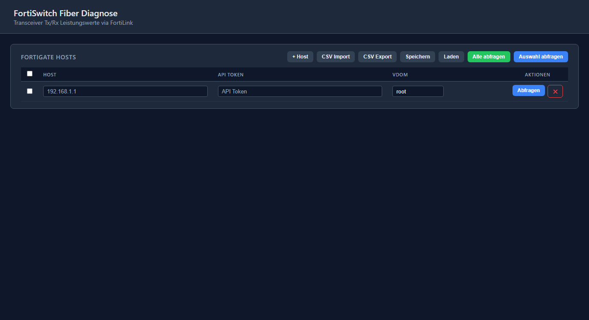

# FortiSwitch Fiber Diagnose

Web-Tool zur Diagnose von Fiber-Transceiver-Ports auf FortiSwitch-Geräten, die über FortiLink von einer FortiGate verwaltet werden. Liest Tx/Rx Power-Werte, Schwellwerte (Warning/Alarm) und Transceiver-Informationen über die FortiGate REST API aus.



## Features

- **Dashboard** — Zusammenfassung mit Gesamtzahl Switches, Fiber-Ports, OK/Warning/Alarm/Down als farbige Badges
- **Multi-Host-Unterstützung** — Mehrere FortiGates gleichzeitig abfragen (parallel im Backend)
- **CSV Import/Export** — Host-Listen als CSV importieren und exportieren
- **Speichern/Laden** — Host-Konfiguration im Browser persistieren (localStorage)
- **Transceiver-Diagnose** — Tx/Rx Power mit farbcodierter Bewertung (OK/Warning/Alarm)
- **Temperatur-Anzeige** — Switch-Temperatur aus der Health-Status API mit farbcodiertem Badge
- **Port-Details** — Klick auf einen Port zeigt alle Schwellwerte (Alarm/Warning High/Low)
- **Sortierbare Tabellen** — Klick auf Spaltenheader sortiert nach Port, Status, Tx/Rx Power etc.
- **Filter** — Ergebnisse nach Freitext, Link-Status, Power-Level und Vendor filtern
- **Ergebnis-Export** — Diagnosedaten als CSV oder PDF exportieren (inkl. Temperatur)
- **Übersichtliche Darstellung** — Switches als aufklappbare Karten mit Zuordnung zur FortiGate
- **Parallele Abfragen** — Hosts, Switches und Ports werden parallel abgefragt für maximale Geschwindigkeit

## Voraussetzungen

- Python 3.8+
- FortiGate mit FortiOS 7.6+ und REST API Zugang
- API-Token mit Lesezugriff auf `switch-controller` (Access Group: `wifi`)

## Installation

```bash
git clone https://github.com/xozy22/fgt-fsw-fiber-diagnose.git
cd fgt-fsw-fiber-diagnose
pip install -r requirements.txt
```

## Starten

```bash
python app.py
```

Anschließend im Browser öffnen: **http://127.0.0.1:5000**

## Verwendung

### Manuell

1. Host (IP/FQDN der FortiGate), API-Token und VDOM eingeben
2. Auf **Abfragen** klicken

### CSV Import

CSV-Datei mit folgendem Format vorbereiten:

```csv
host;token;vdom
192.168.1.1;dein-api-token;root
10.0.0.1;anderer-token;root
```

Trennzeichen `,` und `;` werden unterstützt. Header-Zeile ist optional.

## API-Endpunkte (FortiGate)

Das Tool nutzt folgende FortiOS Monitor API Endpunkte:

| Endpunkt | Beschreibung |
|---|---|
| `/api/v2/monitor/switch-controller/managed-switch/status` | Managed Switches und Ports auslesen |
| `/api/v2/monitor/switch-controller/managed-switch/transceivers` | Transceiver-Module aller Switches |
| `/api/v2/monitor/switch-controller/managed-switch/tx-rx` | Tx/Rx Power pro Port |
| `/api/v2/monitor/switch-controller/managed-switch/health-status` | Switch-Temperatur und Health-Status |

## FortiGate API-Token erstellen

1. FortiGate GUI > **System > Administrators**
2. **Create New > REST API Admin**
3. Profil mit Lesezugriff auf `switch-controller` zuweisen
4. Token generieren und kopieren

## Lizenz

MIT
